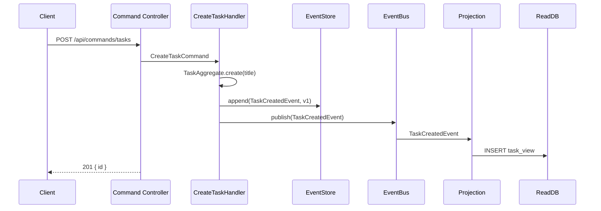
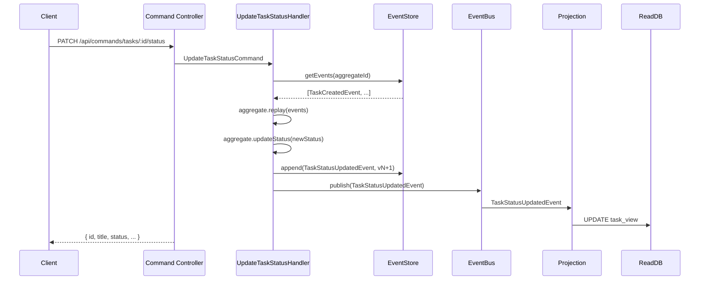
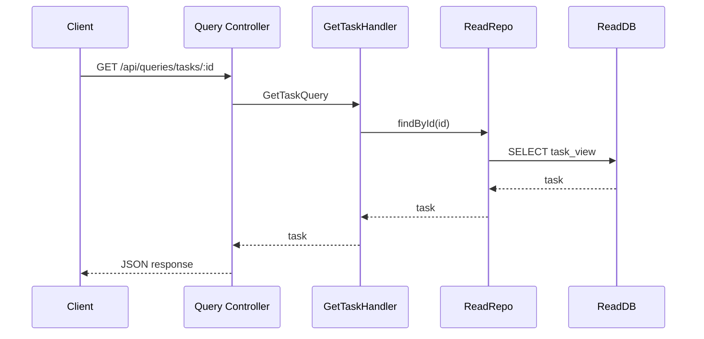
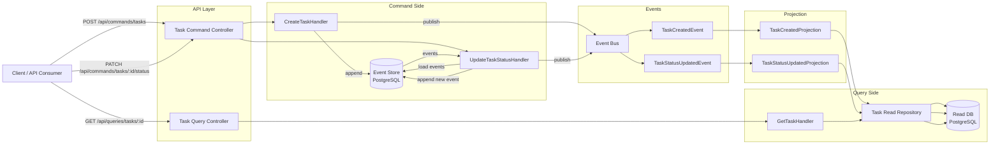

# CQRS + Event Sourcing with Express

A practical demo combining **CQRS (Command Query Responsibility Segregation)** and **Event Sourcing** using **Node.js, Express, TypeScript, and PostgreSQL**.

Instead of storing the current state of a task in a database row, every state change is recorded as an append-only sequence of events. The current state is reconstructed by replaying those events — this is Event Sourcing.

---

## How CQRS + Event Sourcing Work Together

| Pattern | Role |
|---|---|
| **CQRS** | Separates the write model (commands) from the read model (queries). Commands go through one path, queries through another. |
| **Event Sourcing** | Stores all state changes as an append-only event log instead of mutable rows. The event store is the source of truth. |
| **Projections** | Subscribe to events and build denormalized read models optimized for queries. |

**Flow:**

1. Client sends a **command** → handler validates and appends an **event** to the event store
2. The event is **published** on an in-memory event bus
3. **Projections** consume the event and update the read DB
4. Client sends a **query** → handler reads from the read DB

---

## Prerequisites

- **Node.js** `24.15.0` (see `.nvmrc`)
- **pnpm** `10.27.0`
- **PostgreSQL** — two databases (event store and read DB)

---

## Setup

```bash
# Install dependencies
pnpm install

# Copy and configure environment
cp .env.example .env
```

Edit `.env` with your PostgreSQL connection strings.

---

## Configuration

| Variable | Description |
|---|---|
| `WRITE_DB_URL` | PostgreSQL connection string for the event store database |
| `READ_DB_URL` | PostgreSQL connection string for the read (denormalized) database |
| `PORT` | Server port (default `3001`) |

---

## Database Schema

### Event Store DB — `event_store` table (append-only log)

```sql
CREATE TABLE event_store (
  id             SERIAL PRIMARY KEY,
  aggregate_id   UUID NOT NULL,
  aggregate_type TEXT NOT NULL,
  event_type     TEXT NOT NULL,
  event_data     JSONB NOT NULL,
  version        INTEGER NOT NULL,
  created_at     TIMESTAMP DEFAULT NOW(),
  UNIQUE(aggregate_id, version)
);
```

Each row is an immutable event. The `(aggregate_id, version)` unique constraint provides **optimistic concurrency control** — if two writers try to append at the same version, one fails.

### Read DB — `task_view` table (denormalized read model)

```sql
CREATE TABLE task_view (
  id         UUID PRIMARY KEY,
  title      TEXT NOT NULL,
  status     TEXT NOT NULL DEFAULT 'OPEN',
  created_at TIMESTAMP DEFAULT NOW()
);
```

This table is rebuilt from events by projections. It is **not** the source of truth — it can be dropped and recreated at any time by replaying all events.

---

## Project Structure

```
src/
├── server.ts                          # Entry point
├── app.ts                             # Dependency wiring
├── api/
│   ├── task.command.controller.ts     # POST/PATCH routes for commands
│   └── task.query.controller.ts       # GET routes for queries
├── domain/
│   ├── task.status.ts                 # TaskStatus type ('OPEN' | 'IN_PROGRESS' | 'DONE')
│   └── task.aggregate.ts              # Task aggregate — replays events to reconstruct state
├── commands/
│   ├── create-task/
│   │   ├── create-task.command.ts     # CreateTaskCommand DTO
│   │   └── create-task.handler.ts     # Validates + appends TaskCreatedEvent
│   └── update-task-status/
│       ├── update-task-status.command.ts
│       └── update-task-status.handler.ts  # Loads aggregate, validates, appends TaskStatusUpdatedEvent
├── queries/
│   └── get-task/
│       ├── get-task.query.ts          # GetTaskQuery DTO
│       └── get-task.handler.ts        # Reads from read DB
├── events/
│   ├── domain-event.ts                # DomainEvent interface
│   ├── event-bus.ts                   # In-memory pub/sub
│   ├── task-created.event.ts          # Payload: aggregateId, title, status, createdAt
│   └── task-status-updated.event.ts   # Payload: aggregateId, status, updatedAt
├── event-store/
│   ├── event-store.ts                 # EventStore interface (append, getEvents)
│   └── event-store.pg.ts             # PostgreSQL implementation with optimistic concurrency
├── projections/
│   ├── task-created.projection.ts     # Inserts into task_view on TaskCreatedEvent
│   └── task-status-updated.projection.ts  # Updates task_view on TaskStatusUpdatedEvent
└── infrastructure/
    └── repositories/
        ├── task-read.repo.ts          # (interface placeholder)
        └── task-read.repo.pg.ts       # PostgreSQL read repository + TaskReadModel
```

---

## Events

| Event | Payload | Published By |
|---|---|---|
| `TaskCreatedEvent` | `aggregateId`, `title`, `status`, `createdAt` | `CreateTaskHandler` |
| `TaskStatusUpdatedEvent` | `aggregateId`, `status`, `updatedAt` | `UpdateTaskStatusHandler` |

Events are stored as `JSONB` in the `event_store` table and include a `version` number for aggregate consistency.

---

## API Endpoints

| Method | Path | Description |
|---|---|---|
| `POST` | `/api/commands/tasks` | Create a new task (appends `TaskCreatedEvent`) |
| `PATCH` | `/api/commands/tasks/:id/status` | Update task status (appends `TaskStatusUpdatedEvent`) |
| `GET` | `/api/queries/tasks/:id` | Get task from read DB |

---

## Running

```bash
# Development (with hot reload)
pnpm dev

# Build
pnpm build

# Production
pnpm start
```

A `test.rest` file is included for quick API testing with REST Client.

---

## Key Concepts Demonstrated

### Event Sourcing

- **Append-only:** Events are never mutated or deleted. The event store is an immutable log.
- **State reconstruction:** The `TaskAggregate.replay()` method replays all events for a given aggregate to compute the current state.
- **Optimistic concurrency:** The `(aggregate_id, version)` unique constraint prevents lost updates when concurrent commands target the same aggregate.

### CQRS

- **Separate models:** Commands use the event store (write path). Queries use `task_view` (read path).
- **Projections bridge the gap:** Events published by command handlers are consumed by projections that update the read model.

### Why combine them?

CQRS + Event Sourcing together give you:
- A complete audit log of every change
- The ability to rebuild read models from scratch
- Temporal queries ("what did the state look like at version N?")
- Strong consistency within the aggregate boundary

---

## Differences from the Simple CQRS Demo

| Aspect | Simple CQRS (`cqrs/express/`) | CQRS + Event Sourcing (`cqrs/express-event-sourcing/`) |
|---|---|---|
| Write model | `tasks` table (mutated in place) | `event_store` table (append-only log) |
| State | Direct SQL `UPDATE` | Reconstructed by replaying events |
| Source of truth | Current DB row | Event log |
| Concurrency | Last write wins | Optimistic locking via version |
| Audit trail | None | Full history of every change |

---

## Command Flow (Create Task)



## Command Flow (Update Status)



## Query Flow



## Flow Chart


