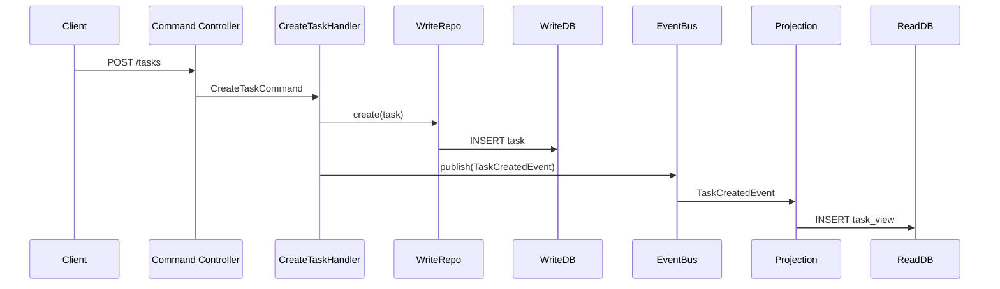
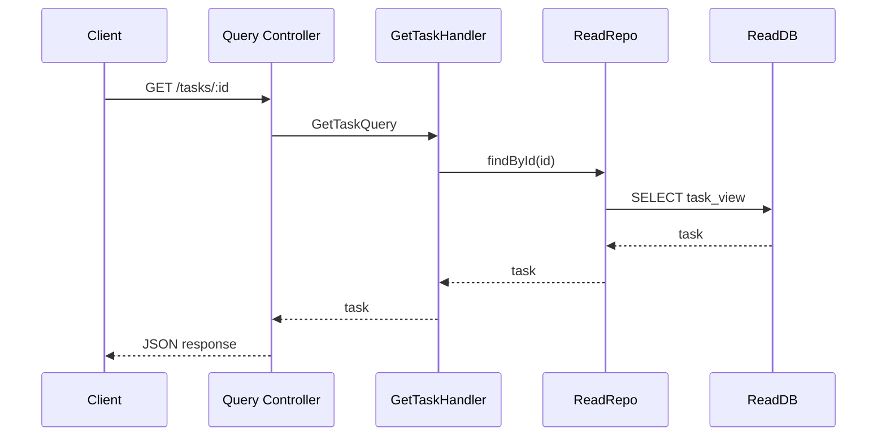

# CQRS Express Example

A simple **CQRS (Command Query Responsibility Segregation)** demo using **Node.js, Express, TypeScript, and PostgreSQL**.  
It demonstrates:

- Separation of **Command (Write) and Query (Read) models**
- Event-driven **projections** to keep the read database in sync
- Clean architecture with **Controllers → Handlers → Repositories → DB**
- Type-safe **events and in-memory event bus**

This project is intended as a **learning reference** for building CQRS-based backends.

---

## Features

- **Commands:**  
  Create tasks via a dedicated command handler and write DB.
- **Queries:**  
  Fetch tasks via a dedicated query handler and read DB.
- **Event Bus & Projection:**  
  Automatically updates the read DB whenever a task is created.
- **Separate databases:**  
  - `task_write_db` → source of truth  
  - `task_read_db` → optimized for reads

---

## Command Flow



## Query Flow


## Flow Chart
```mermaid
  flowchart LR
    Client[Client / API Consumer]

    subgraph API Layer
        CC[Task Command Controller]
        QC[Task Query Controller]
    end

    subgraph Command Side
        CH[CreateTaskHandler]
        WR[Task Write Repository]
        WDB[(Write DB\nPostgreSQL)]
    end

    subgraph Events
        EB[Event Bus]
        EVT[TaskCreatedEvent]
    end

    subgraph Projection
        PRJ[TaskCreatedProjection]
    end

    subgraph Query Side
        QRH[GetTaskHandler]
        RR[Task Read Repository]
        RDB[(Read DB\nPostgreSQL)]
    end

    %% Command flow
    Client -->|POST /api/commands/tasks| CC
    CC --> CH
    CH --> WR
    WR --> WDB
    CH -->|publish| EB
    EB --> EVT
    EVT --> PRJ
    PRJ --> RR
    RR --> RDB

    %% Query flow
    Client -->|GET /api/queries/tasks/:id| QC
    QC --> QRH
    QRH --> RR
    RR --> RDB
  ```


